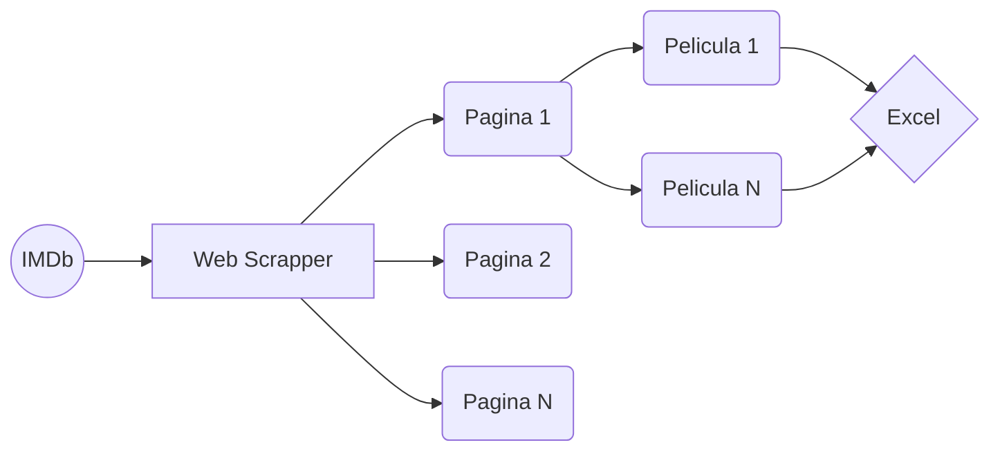
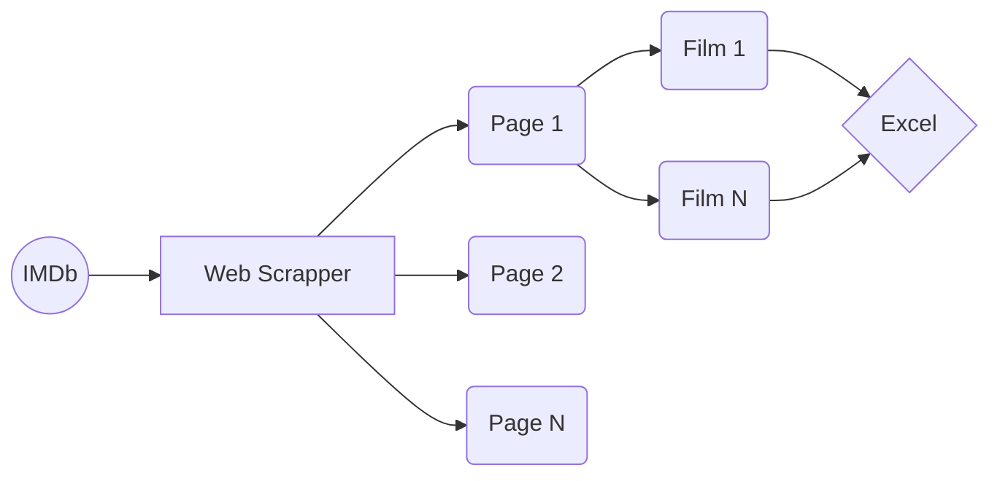

# Film Scrapper
# Español
## Descripción
El código de este repositorio se ha generado en el contexto de la PRAC 1 de la asignatura de Tipología y ciclo de vida de los datos, durante el semestre Feb-2023 a Jun-2023.

La estructura principal del código se basa en dos scripts desarrollados en Python, el primero main.py permite inicializar la llamada a IMDb para ir iterando elemento a elemento para obtener información de cada película. El fichero extractions.py por otro lado continene todas las funciones para extrar la información de cada div en la web permitiendo modificar exactamente el parámetro de extracción que queramos




## Miembros del equipo
La actividad ha sido realizada conjuntamente por Eduardo Ranedo y Luis Piñuela

## Ficheros
* **src/main.py:** Contiene la lógica base del programa de scripting y es el fichero que tendremos que ejecutar para inicializar el scripting.
* **src/extractions.py:** Contiene las diferentes funciones que son llamadas por la clase main para poder extraer la información que se precisa.
* **csv/data.csv:** Datos extraidos desde IMDb en relación a las películas.

## Ejecución del Script

Paquetes necesarios para usar el Scrapper:

```
pip install pandas
pip install requests
pip install lxml
pip install beautifulsoup4
```

## Recursos
TBD

# English
## Description.
The code of this repository has been generated in the context of PRAC 1 of the Typology and Data Lifecycle course, during the semester Feb-2023 to Jun-2023.

The main structure of the code is based on two scripts developed in Python, the first one main.py allows to initialize the call to IMDb to iterate element by element to obtain information of each movie. The extractions.py file on the other hand contains all the functions to extract the information of each div in the web allowing to modify exactly the extraction parameter we want.




## Team members
The activity has been carried out in collaboration with Eduardo Ranedo and Luis Piñuela.

## Files
* **src/main.py:** Contains the base logic of the scripting program and is the file that we will have to execute to initialize the scripting.
* **src/extractions.py:** Contains the different functions that are called by the main class to be able to extract the required information.
* **csv/data.csv:** Data extracted from IMDb in relation to the movies.


## Script execution

Necessary packages to use the Scrapper:

```
pip install pandas
pip install requests
pip install lxml
pip install beautifulsoup4
```

## Resources
TBD
